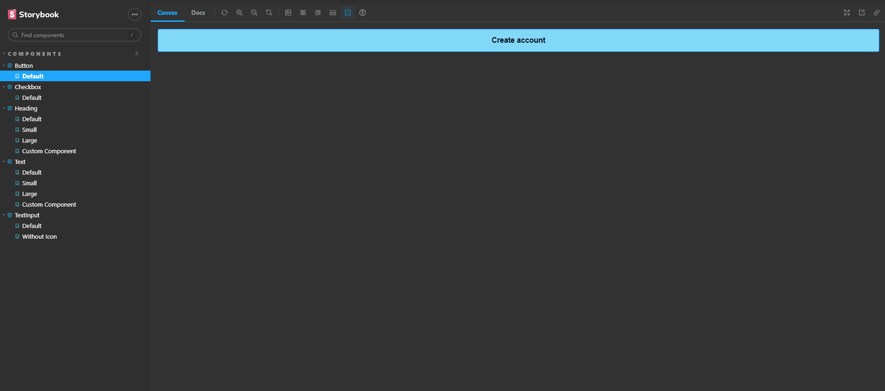

<h1 align="center">
  <span>Design System with Storybook</span>
</h1>

<p align="center">
  <a href="#-projeto">Projeto</a>&nbsp;&nbsp;&nbsp;|&nbsp;&nbsp;&nbsp;
  <a href="#-tecnologias">Tecnologias</a>&nbsp;&nbsp;&nbsp;|&nbsp;&nbsp;&nbsp;
  <a href="#-instalação">Instalação</a>&nbsp;&nbsp;&nbsp;|&nbsp;&nbsp;&nbsp;
  <a href="#memo-licença">Licença</a>
</p>

<br>

<p align="center">
  
</p>

<br>

## 💻 Projeto

Aplicação desenvolvida durante o Ignite Lab promovido pela Rocketseat. Objetivo da aplicação é desenvolver um design system com tecnologias modernas de UI/UX.
Além disso, foi utilizou-se os componentes desenvolvidos em uma tela de login simples.

[Documentação Storybook](https://brunocs90.github.io/ignite-lab-design-system/?path=/story/components-button--default).

[Template Figma](https://www.figma.com/file/oDZgkKwQGeVnUDukxRLZC6/Ignite-Lab-Desing-System?node-id=0%3A1).

## 🚀 Tecnologias

Esse projeto foi desenvolvido com as seguintes tecnologias:

- [Tailwindcss](https://tailwindcss.com/) framework de css com classes prontas para estilização.

```
npm install -D tailwindcss postcss autoprefixer
npx tailwindcss init -p
```
- [Storybook](https://storybook.js.org/docs/react/get-started/introduction) é usada para documentar os componentes, além de facilitar a visualização do componente.

```
npx sb init --builder @storybook/builder-vite --use-npm
npm run storybook
```
- [clsx](https://www.npmjs.com/package/clsx) possibilita a aplicação de css em componentes de forma condicional.
```
npm install --save clsx
```
- [radix-ui](https://www.radix-ui.com/) biblioteca de componentes que fornece componentes de UI para a aplicação, utilizado para design systems (instalar o componente slot e checkbox)

```
npm install @radix-ui/react-slot @radix-ui/react-checkbox
```
- [Slot](https://www.radix-ui.com/docs/primitives/utilities/slot) retorna as propriedades de um componente para o seu children próximo.

- [Phosphor](https://phosphoricons.com/) biblioteca de ícones.

```
npm i phosphor-react
```
- [a11y](https://storybook.js.org/addons/@storybook/addon-a11y) utilizado para verificar a acessibilidade da aplicação.

```
npm install @storybook/addon-a11y
```
- [Transform tool](https://transform.tools/) utilizado para converter um svg em componente React.

## 📥 Instalação

Faça um clone desse repositório e acesse o diretório. Em seguida acesse o endereço [Storybook deployer](https://github.com/storybookjs/storybook-deployer) para mais informações sobre os comandos abaixo:

```
npm i @storybook/storybook-deployer --save-dev
```

Adicionar o seguinte script no package.json para fazer deploy no GitHub Pages
```
"deploy-storybook": "storybook-to-ghpages"
```

Para gerar os arquivos estáticos de build
```
npm run build-storybook
```

Deploy de alterações do storybook
```
npm run deploy-storybook
```


## :memo: Licença

Esse projeto está sob a licença MIT. Veja o arquivo [LICENSE](LICENSE.md) para mais detalhes.

---
**Desenvolvido por [Bruno César](https://github.com/brunocs90).**
